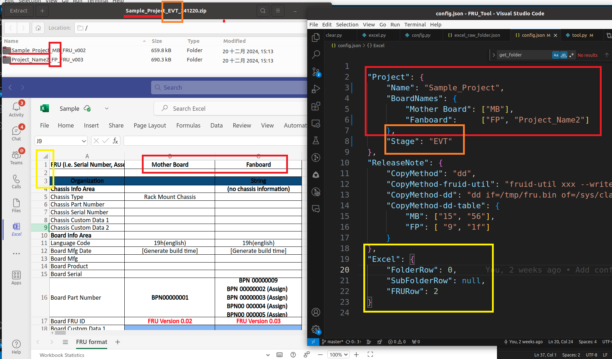

# FRU Generator

## Introduction

This project provides a tool for generating FRU files, with options for configuration and cleaning. It is designed for use in Python 3 environments and relies on specific modules for functionality.

## Requirements

1. Python 3
2. Python module: `xlrd` (version 1.2.0)

## Configuration

The configuration file is `config.json`, which contains the following settings:

- **Project**
  - **Name**: Affects the final compressed file name and folder prefix.
  - **BoardNames**: Determines the folder names.
  - **Stage**: Affects the final compressed file name.

- **ReleaseNote**
  - **CopyMethod**: Determines the release note (not critical).

- **Excel**
  - **FolderRow**: Specifies the row in the Excel file for `BoardNames` (0-based index).
  - **FRURow**: Specifies the row in the Excel file where data starts (0-based index).

- **Example**
    

## Usage

### Create FRU
To generate a FRU:
  Run the following command with the target Excel file:
   ```bash
   python3 excel.py [target.xlsx]
   ```
   ```bash
   python3 tool.py
   ```
   The resulting zip file will be named: **projectname_stage_currentdate.zip**

### Create FRU ICT
To generate an ICT FRU (requires running "Create FRU" first):
  Run the following command:
   ```bash
   python3 toolconfig.py | xargs python3 ict_tool.py
   ```
   The resulting zip file will be saved as: **ICT/projectname_stage_ICT_currentdate.zip**

### Clean
To remove all data except for zip files:
  Run the clean script:
   ```bash
   python3 clear.py
   ```

